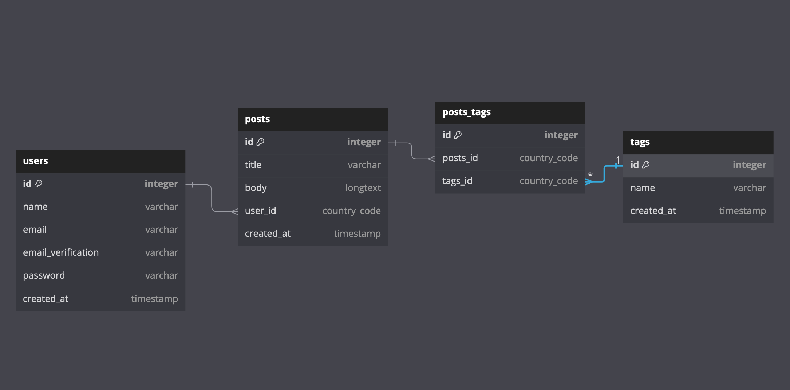

# Selfwork 15 laravel

### Traccia per creare un progetto riguardante un blog

Creare un nuovo progetto blog e creare su GitHub un progetto con nome laravel_14_nome_cognome

con tutte le best practices viste fino ad ora ma senza Fortify Completo (impostate solo le funzionalità di Login e Register senza il logout, navbar con @guest/@auth middleware ecc,,,).

-Crea 2 risorse CRUD (Model, Migration, Request, Route, View) per:

- Post
    - Title, stringa
    - body, longtext
    - user_id, chiave esterna
- Tag
    - Name, stringa

Le relazioni saranno:

- 1 A N (One to Many) tra Post e User (Un utente puo scrivere tanti post, un post appartiene ad un utente)
- N a N (Many to Many) Tra Post e Tag (Un Post puo avere tanti Tag, un Tag puo avere tanti Post)

EXTRA

- Dare la possibilità solo all'utente che ha creato l'entità di modificarla
- Visualizzare tutte le entità create da un dato utente



```jsx
Table posts {
  id integer [primary key]
  title varchar
  body longtext
  user_id country_code
  created_at timestamp
}

Table tags {
  id integer [primary key]
  name varchar
  created_at timestamp
}

Table users {
  id integer [primary key]
  name varchar
  email varchar
  email_verification varchar
  password varchar
  created_at timestamp
}

table posts_tags {
  id integer [primary key]
  posts_id country_code
  tags_id country_code
}

Ref: "users"."id" < "posts"."user_id"

Ref: "posts"."id" < "posts_tags"."posts_id"

Ref: "tags"."id" < "posts_tags"."tags_id"
```

## Analisi e task

- Utilizzare tutte le **best practice** usate finora
    - Named Routes
    - Controller
    - Components/Layout
        - Passare le categorie dentro il componente navbar
    - Scaffolding con **Vite**
    
    Autenticazione con **Laravel Fortify**
    
    - login
    - register
    - logout
    - password Dimenticata e Password Reset
    - Profilo
- **CRUD** completo di **due modelli** Article e Category
    - index
    - create
    - store
    - show
    - edit
    - update
    - delete
- Relazione **One-to-Many** tra User e Article
- Relazione **Many-to-Many** tra Article e Category

EXTRA

- Dare la possibilità solo all'utente che ha creato l'entità di modificarla;
- Ricerca di un articolo per titolo;